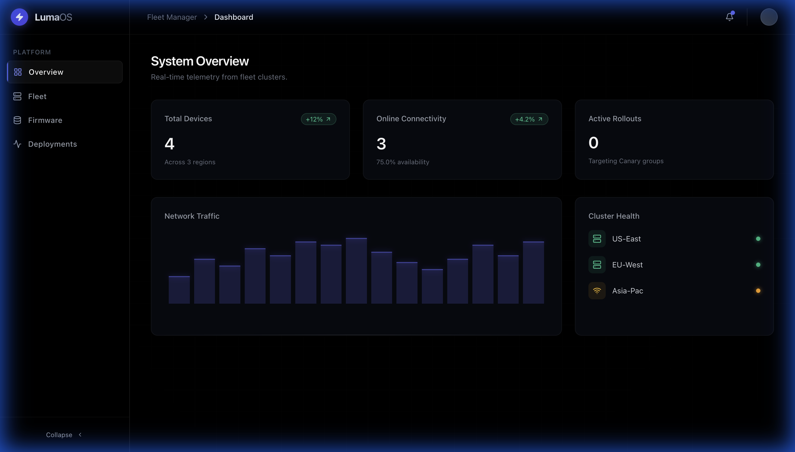
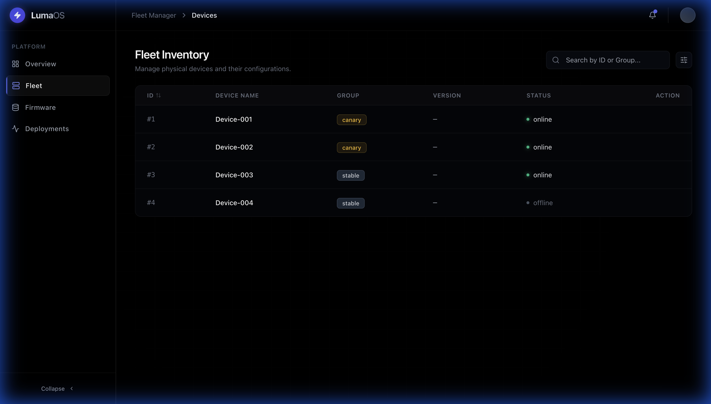
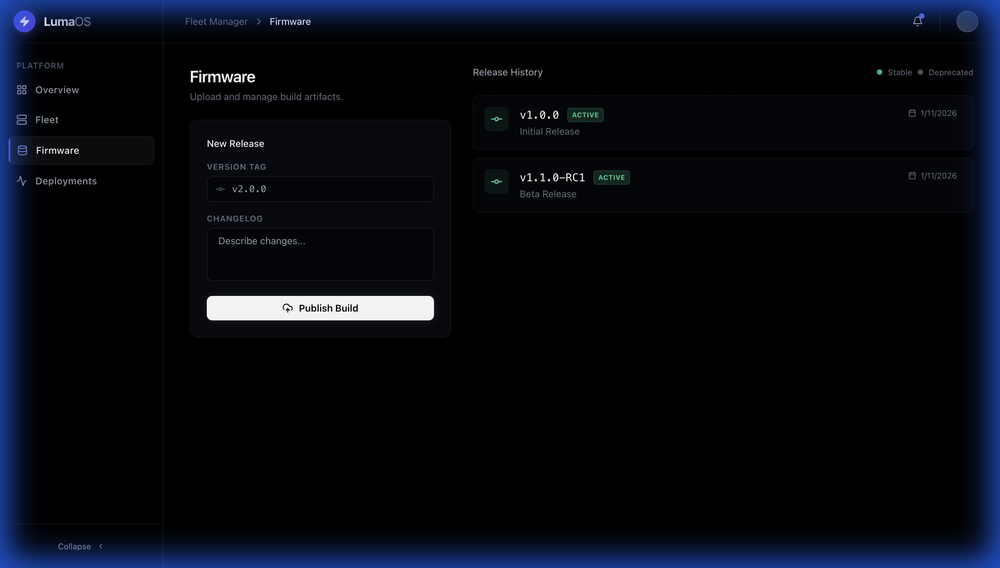
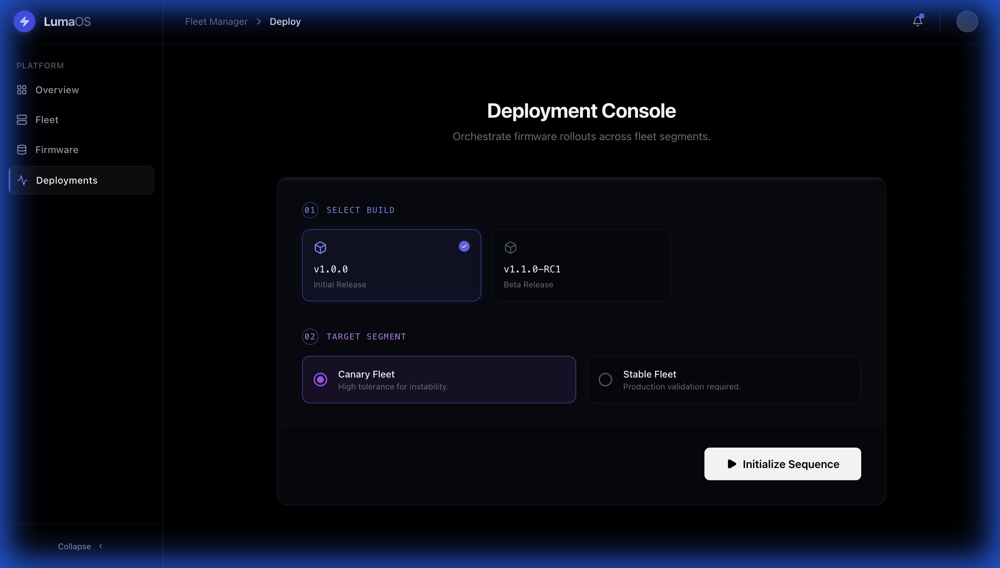

# Firmware Fleet Manager - Walkthrough

This document provides a visual tour of the Firmware Fleet Manager platform and demonstrates the complete OTA deployment workflow.

## Overview

The Firmware Fleet Manager is an enterprise-grade platform for managing firmware updates across device fleets with advanced features like canary deployments, real-time monitoring, and rollout health tracking.

## UI Design Philosophy

The interface follows a "LumaOS" design language featuring:
- **Dark Mode**: Deep slate backgrounds (#030712) with subtle grid patterns
- **Glassmorphism**: Translucent panels with backdrop blur effects
- **Clean Typography**: Inter font with precise tracking and hierarchy
- **Smooth Animations**: Framer Motion powered transitions and micro-interactions
- **Premium Aesthetics**: Inspired by Linear, Vercel, and modern DevOps tools

---

## Application Screenshots

### 1. Mission Control (Dashboard)
The command center provides real-time fleet telemetry and system health metrics.

**Features:**
- Live connectivity statistics (Total Devices, Online Devices, Active Deployments)
- Network traffic visualization
- Regional cluster health indicators
- Trend metrics with percentage changes



---

### 2. Fleet Inventory
Comprehensive device management with advanced filtering and search capabilities.

**Features:**
- Real-time device status indicators
- Group segmentation (Canary, Stable, Custom)
- Version tracking per device
- Sortable columns with search functionality
- Status badges with glow effects



---

### 3. Firmware Vault
Centralized firmware version management and release history.

**Features:**
- Upload new firmware builds with changelogs
- Version history with release dates
- Active/deprecated status tracking
- Monospaced version identifiers
- Git-style commit visualization



---

### 4. Deployment Console
Step-by-step rollout wizard for orchestrating firmware updates.

**Features:**
- Visual firmware selection cards
- Target segment selection (Canary vs Stable Fleet)
- Progressive deployment flow (Step 01, Step 02, Execute)
- Live deployment status with animations
- Safety confirmations and rollback options



---

## Quick Start Workflow

### 1. Seed Sample Data
```bash
curl -X POST http://localhost:8000/seed
```
This creates:
- 4 sample devices (2 canary, 2 stable)
- 2 firmware versions (v1.0.0, v1.1.0-RC1)

### 2. Navigate the Platform
1. **Dashboard** - View system overview
2. **Fleet** - Inspect device inventory
3. **Firmware** - Create a new version (e.g., v2.0.0)
4. **Deployments** - Deploy to Canary group

### 3. Test Canary Deployment
1. Go to **Deployments** tab
2. Select `v1.1.0-RC1` firmware
3. Choose "Canary Group"
4. Click "Initialize Sequence"
5. Return to **Fleet** tab to see updates propagated

### 4. Monitor Results
- Check **Dashboard** for deployment statistics
- Verify devices in Canary group show new version
- Observe status transitions (offline → updating → online)

---

## Technical Architecture

### Frontend Stack
- **React 19** - Component library
- **TailwindCSS v3** - Utility styling
- **Framer Motion** - Animations
- **Vite** - Build tooling
- **Axios** - HTTP client

### Backend Stack
- **FastAPI** - Python async framework
- **SQLAlchemy** - Database ORM
- **Uvicorn** - ASGI server
- **Pydantic** - Data validation

### Database
- **SQLite** (Development)
- **PostgreSQL** (Production)

---

## Running Locally

### Backend
```bash
source venv/bin/activate
uvicorn backend.main:app --reload
# Available at: http://localhost:8000
```

### Frontend
```bash
npm run dev
# Available at: http://localhost:5173
```

---

## Key Features Demonstrated

✅ **Canary Deployments** - Test updates on subset before full rollout  
✅ **Real-time Monitoring** - Live fleet health and deployment status  
✅ **Version Control** - Track firmware releases with changelogs  
✅ **Device Grouping** - Segment fleet by stability tolerance  
✅ **Modern UI/UX** - Premium aesthetic with smooth interactions  
✅ **RESTful API** - Well-documented endpoints at `/docs`  

---

## Production Considerations

**Security:**
- Implement authentication (JWT tokens)
- Add RBAC for deployment permissions
- Use HTTPS for all connections

**Scalability:**
- Switch to PostgreSQL for production
- Implement Redis for caching
- Use message queues (RabbitMQ/Kafka) for async updates

**Monitoring:**
- Add Prometheus metrics
- Integrate Grafana dashboards
- Set up alerting for failed deployments

**Reliability:**
- Implement automatic rollback on high failure rate
- Add deployment approval workflows
- Enable audit logging for compliance

---

## Next Steps

1. **Extend Device Metadata**: Add hardware specs, location, connectivity type
2. **Advanced Deployment Strategies**: Gradual rollout percentages, scheduled deployments
3. **Notification System**: Email/Slack alerts for deployment events
4. **Analytics Dashboard**: Success rates, deployment duration charts
5. **File Upload**: Direct binary upload instead of mock file paths

---

## Support

For issues, feature requests, or contributions:
- **GitHub**: [pradyumnakr/Firmware-Fleet-Manager](https://github.com/pradyumnakr/Firmware-Fleet-Manager)
- **Issues**: Create a GitHub issue with detailed description

---

**Built with ❤️ for modern DevOps workflows**
